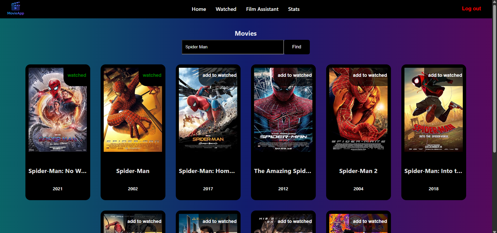

# MOVIEAPP 🎥

We've collaboratively created a web application for Browse movies. After creating an account, users can access various features, such as rating movies, viewing statistics for films they've watched, or chatting with a private Movie Assistant who will answer any film-related questions.

---

## 🛠 **Technologies Used**

 - Python
 - Flask
 - React
 - Neon Postgres
 - OMDb API
 - OpenAI API

All required libraries are in the requirements.txt file and the frontend/package.json file

---

## ⚙️ **Installation Steps**

To install the project, follow these steps:

1. Download libraries from requirements.txt:

pip install -r requirements.txt

2. Install npm on the first run (from the frontend folder):

npm install

3. Add .env file and frontend/services/key.js with the required constants

4. Run the application using either method A or B:

A. Using the batch file:

.\start_app.bat (from the filmapp folder)
DO NOT close the command prompt windows that open!

B. Using separate terminals:

In one terminal:

python run.py

In a second terminal:

cd frontend
npm run dev

Register or log in to your account and enjoy all the application's features!

---

## 🤝 **Authors**

Project's GitHub: https://github.com/mleczako/filmapp.git

- [Liwia Dzikuć](https://github.com/liwiadzz)
- [Maciej Durkalec](https://github.com/maciosdur)
- [Stanisław Kaczmarek](https://github.com/stanislawkaczmarek1)
- [Marcin Mleczak](https://github.com/mleczako)

---

## 📸 **Screenshots**

---
